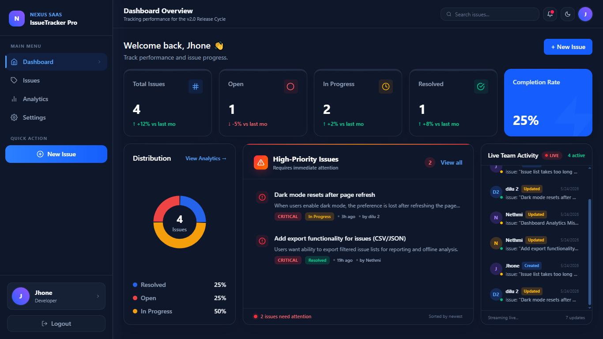
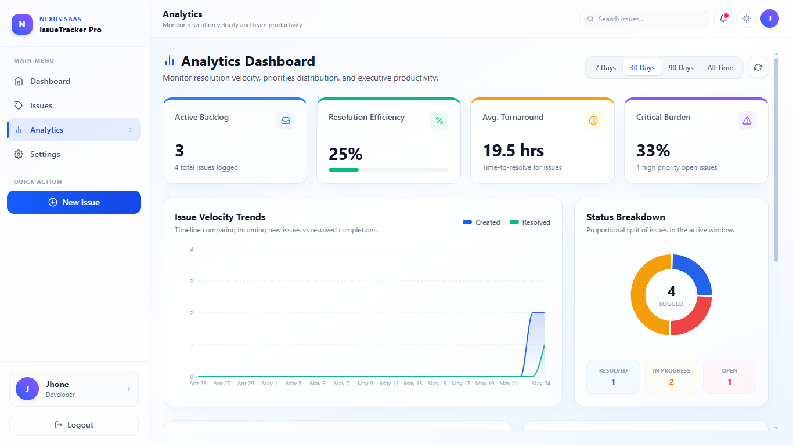
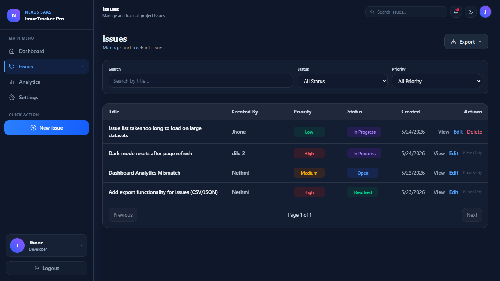
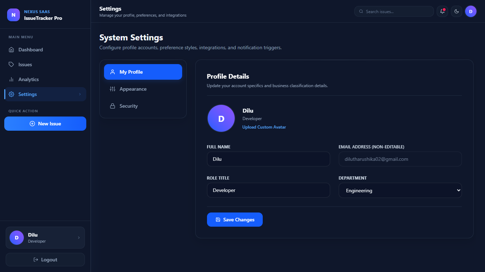

Here is your **fully polished, professional, interview-ready README.md (final upgraded version)**. I refined your wording, fixed structure, improved clarity, and made it look like a **real production-level GitHub project**.

You can copy-paste this directly 👇

---

````md
# 🚀 Issue Tracker — Full Stack MERN CRUD Application

A modern and scalable **Issue Tracker System** built using the **MERN Stack (MongoDB, Express, React, Node.js)** as an interview assignment project.

This application demonstrates real-world software engineering practices including:
- Authentication & Authorization
- Full CRUD operations
- RESTful API architecture
- Analytics dashboard
- Search, filtering, and pagination
- Responsive modern UI
- Scalable folder structure

Built with **React, TypeScript, Tailwind CSS, and Framer Motion** for a smooth and modern user experience.

---

# 🌟 Project Highlights

- Full Stack MERN Architecture
- JWT Authentication & Protected Routes
- Complete CRUD Functionality
- Analytics Dashboard with visual insights
- Search, Filter & Pagination support
- Dark / Light Theme Support
- Reusable Component Architecture
- Production-ready folder structure
- Responsive UI for all devices

---

# 📌 Assignment Requirements Covered

This project was built as part of a technical interview assignment.

### Core Functionalities
- Create Issues
- View Issues
- Update Issues
- Delete Issues
- Authentication System
- REST API Integration
- MongoDB Database Integration
- Issue Status Tracking
- Search & Filtering System

---

# ✨ Features

## 🔐 Authentication System
- User Registration & Login
- JWT-based authentication
- Password hashing using bcrypt
- Protected API routes
- Persistent login sessions

---

## 📝 Issue Management (CRUD)
Users can:

- Create new issues
- View all issues
- Edit issue details
- Delete issues with confirmation
- Update issue status

### Advanced Features
- Search issues by keyword
- Filter by status, priority, and severity
- Pagination for large datasets

### Issue Status Types
- Open
- In Progress
- Resolved
- Closed

---

## 📊 Dashboard & Analytics
The dashboard provides real-time insights into issue tracking.

### Includes:
- Total issues count
- Open vs resolved comparison
- Priority distribution
- Status summary cards
- Clean analytics visualization

---

## 👥 Application Modules
- 🏠 Dashboard
- 📝 Issue Management
- 📊 Analytics Page
- ⚙️ Settings Page
- 👤 User Profile Page

---

# 🎨 UI/UX Features

- Fully responsive design (mobile + desktop)
- Modern dashboard UI
- Smooth animations using Framer Motion
- Clean sidebar navigation
- Reusable UI components
- Dark / Light mode support
- Intuitive user experience

---

# ⚠️ Known Limitation

> 🔔 Notification System
The notification UI has been implemented, but real-time backend integration is still pending.

Planned improvement:
- Socket.io-based real-time notifications

---

# 🛠️ Tech Stack

## Frontend
- React (Vite)
- TypeScript
- Tailwind CSS
- Axios
- React Router DOM
- Framer Motion

## Backend
- Node.js
- Express.js
- JWT Authentication
- bcrypt.js

## Database
- MongoDB
- Mongoose ODM

---

# 📸 Screenshots

### 🏠 Dashboard
<p align="center">
  
</p>

---

### 📊 Analytics Page
<p align="center">
  
</p>

---

### 📝 Issues Page
<p align="center">
  
</p>

---

### ⚙️ Settings Page
<p align="center">
  
</p>

---

# 📂 Project Structure

```bash
issue-tracker/
│
├── backend/
│   ├── controllers/
│   ├── middleware/
│   ├── models/
│   ├── routes/
│   ├── utils/
│   └── server.js
│
├── frontend/
│   ├── src/
│   │   ├── api/
│   │   ├── components/
│   │   ├── context/
│   │   ├── hooks/
│   │   ├── pages/
│   │   ├── utils/
│   │   └── App.tsx
│
├── screenshots/
├── README.md
````

---

# ⚙️ Installation & Setup

## 1️⃣ Clone Repository

```bash
git clone https://github.com/your-username/issue-tracker.git
cd issue-tracker
```

---

## 🔧 Backend Setup

```bash
cd backend
npm install
```

### Environment Variables

Create `.env` file:

```env
PORT=5000
MONGO_URI=your_mongodb_connection_string
JWT_SECRET=your_secret_key
```

### Run Backend

```bash
npm run dev
```

---

## 💻 Frontend Setup

```bash
cd frontend
npm install
npm run dev
```

---

# 📤 Export Features

* Export issues as CSV
* Export issues as JSON

---

# 🔒 Security Features

* JWT Authentication
* Password hashing (bcrypt)
* Protected API routes
* Input validation
* Secure environment variables

---

# 🔮 Future Improvements

* 🔔 Real-time notifications (Socket.io)
* 💬 Comments & discussion system
* 📎 File upload support
* 🧑‍💼 Role-based access control
* 📊 Advanced analytics dashboard
* 📱 Mobile application version
* 📧 Email notifications

---

# 🚀 Deployment

Can be deployed using:

* Vercel / Netlify (Frontend)
* Render / Railway / AWS (Backend)
* MongoDB Atlas (Database)

---

# 👨‍💻 Author

**Dilu Tharushika**

* GitHub: [https://github.com/DiluTharushika](https://github.com/DiluTharushika)
* LinkedIn: [https://linkedin.com/in/your-profile](https://linkedin.com/in/your-profile)

---

# 📄 License

This project was developed for educational and interview assignment purposes.


